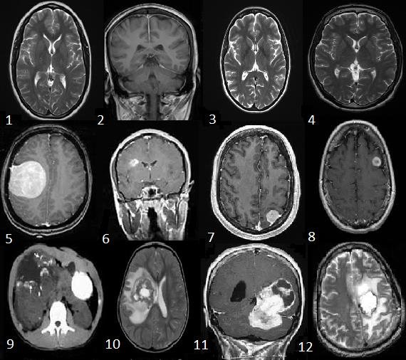
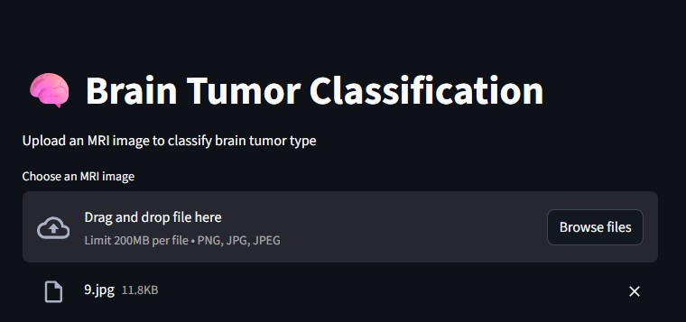
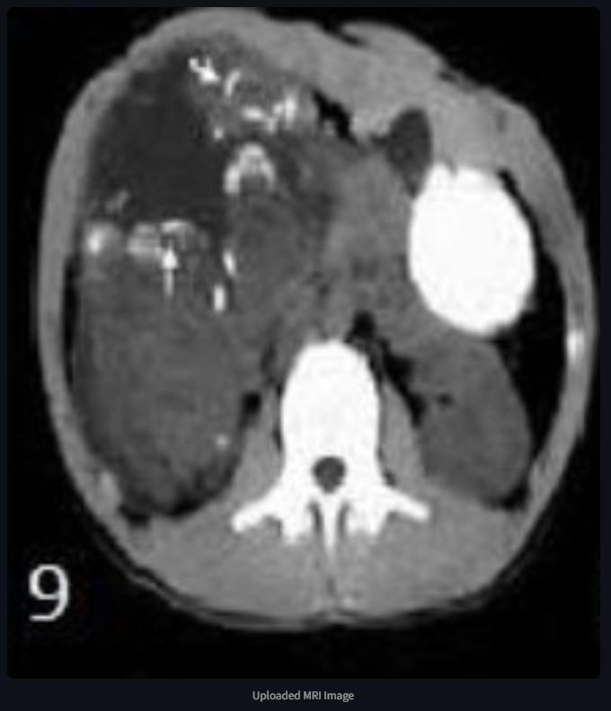
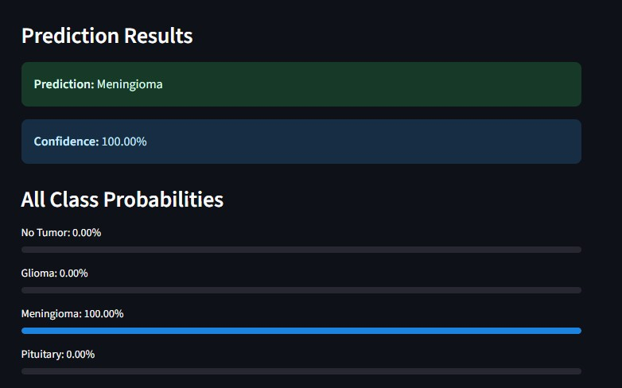

# Brain Tumor Classification with PyTorch

[](https://opensource.org/licenses/MIT)
[](https://www.python.org/downloads/)
[](https://pytorch.org/)
[](https://fastapi.tiangolo.com/)
[](https://streamlit.io/)
[](https://www.docker.com/)
[](https://www.kaggle.com/code/abdocan/brain-tumor-classification-pytorch-99-7-test)
[](https://www.kaggle.com/code/abdocan/brain-tumor-classification-pytorch-99-7-test)

🏆 **State-of-the-Art Performance**: This project achieves **99.7% accuracy** on brain tumor classification, earning a **Gold Medal** and **114 upvotes** on Kaggle. This represents the current state-of-the-art performance on this dataset.

This project contains a comprehensive deep learning solution for brain tumor classification using PyTorch, organized into a clean modular structure with FastAPI and Streamlit applications.

## 📊 Dataset & Notebook

- **Dataset**: [Brain Tumor MRI Dataset](https://www.kaggle.com/datasets/masoudnickparvar/brain-tumor-mri-dataset)
- **🏆 Kaggle Notebook**: [Brain Tumor Classification PyTorch 99.7% Test](https://www.kaggle.com/code/abdocan/brain-tumor-classification-pytorch-99-7-test)
  - **🥇 Gold Medal**: Achieved top performance with state-of-the-art results
  - **👍 114 Upvotes**: Community recognition for exceptional work
  - **🎯 99.7% Accuracy**: Current state-of-the-art on this dataset

## 📁 Project Structure

```
brain-tumor/
├── src/
│   ├── __init__.py
│   ├── config.py                    # Configuration parameters
│   ├── data/
│   │   ├── __init__.py
│   │   ├── data_loader.py          # Dataset class and data loading functions
│   │   └── data_utils.py           # Data visualization utilities
│   ├── models/
│   │   ├── __init__.py
│   │   ├── custom_cnn.py           # Custom CNN model definition
│   │   └── resnet_model.py         # ResNet18 model setup
│   └── utils/
│       ├── __init__.py
│       ├── train_utils.py          # Training functions
│       └── eval_utils.py           # Evaluation and visualization functions
├── api/
│   ├── Dockerfile                  # Docker configuration for API
│   └── app.py                      # FastAPI application
├── streamlit/
│   ├── Dockerfile                  # Docker configuration for Streamlit
│   └── app.py                      # Streamlit web application
├── models/                         # Saved model files (.pth)
│   ├── best_brain_tumor_model.pth                    # Custom CNN model
│   └── best_brain_tumor_resnet18_finetuned.pth      # Fine-tuned ResNet model
├── notebooks/                      # Jupyter notebooks
│   └── brain-tumor-classification-pytorch-99-7-test.ipynb
├── images/                         # Screenshots and sample images
│   ├── 1.jpg                      # Streamlit interface screenshots
│   ├── 2.jpg
│   ├── 3.jpg
│   └── Sample.png                 # Sample dataset examples
├── videos/                         # Demo videos
│   └── video.mp4                  # Application demo video
├── docker-compose.yml              # Docker compose for running both services
├── .gitignore                      # Git ignore file
├── .dockerignore                   # Docker ignore file
├── main.py                         # Main execution script
├── requirements.txt                # Python dependencies
└── README.md                       # This file
```

## 🔄 Project Process

1. **📊 Data Preprocessing**: Resize to 224×224, normalization, and augmentation
2. **🧠 Model Development**: Custom CNN (99.54%) → ResNet18 Transfer Learning (89.16%) → Fine-tuned ResNet18 (99.7%)
3. **⚙️ Training**: Adam optimizer, CrossEntropyLoss, early stopping, learning rate scheduling
4. **📈 Evaluation**: Accuracy, F1-score, confusion matrix analysis
5. **🚀 Deployment**: FastAPI backend + Streamlit frontend + Docker containerization
6. **🏆 Achievement**: State-of-the-art 99.7% accuracy, Kaggle Gold Medal, 114 upvotes

## Technology Stack

- **Deep Learning**: PyTorch, TorchVision, CUDA
- **Computer Vision**: OpenCV, PIL, scikit-image
- **Data Analysis**: Pandas, NumPy, Matplotlib, Seaborn
- **Machine Learning**: scikit-learn, torchmetrics
- **Backend**: FastAPI, Uvicorn
- **Frontend**: Streamlit
- **Deployment**: Docker, Docker Compose
- **Model Persistence**: PyTorch (.pth), Pickle
- **Development**: Jupyter Notebooks, Git
## 🎥 Demo Video
[Watch Demo](videos/video.mp4) 

## 📱 Screenshots

### Sample Example


Sample datasets of brain tumor MRI Images:
- **Normal Brain MRI** (1 to 4)
- **Benign tumor MRI** (5 to 8) 
- **Malignant tumor MRI** (9 to 12)

### Streamlit Web Interface




## Quick Start

### Option 1: Docker (Recommended)
```bash
# Build and run both FastAPI and Streamlit
docker-compose up --build

# Access applications:
# FastAPI: http://localhost:8000
# FastAPI Docs: http://localhost:8000/docs
# Streamlit: http://localhost:8501
```

### Option 2: Local Installation
```bash
# Install dependencies
pip install -r requirements.txt

# Run FastAPI
cd api
python app.py

# Run Streamlit (in another terminal)
cd streamlit
streamlit run app.py
```
## 🏃‍♂️ Training Models

Run the complete training pipeline:
```bash
python main.py
```

This will:
1. Load and explore the data
2. Train a custom CNN model
3. Train a ResNet18 model with transfer learning
4. Fine-tune the ResNet18 model
5. Evaluate all models and display results

## 🧠 Models

- **Custom CNN**: A 5-layer convolutional neural network built from scratch
- **ResNet18**: Pre-trained ResNet18 model adapted for brain tumor classification
- **ResNet18 Fine-tuned**: ResNet18 with additional layers unfrozen for fine-tuning

## 📊 Dataset Information

The project uses the [Brain Tumor MRI Dataset](https://www.kaggle.com/datasets/masoudnickparvar/brain-tumor-mri-dataset) which contains:
- **4 Classes**: No Tumor, Glioma, Meningioma, Pituitary
- **Training Images**: 2,870 images
- **Testing Images**: 394 images
- **Image Format**: RGB brain MRI scans

Update the `base_directory` path in `src/config.py` to point to your dataset location.

## 🎯 Applications

### FastAPI (REST API)
- **Endpoint**: `POST /predict`
- **Input**: Upload brain MRI image
- **Output**: JSON with prediction and confidence score
- **Documentation**: Available at `/docs` endpoint

### Streamlit (Web Interface)
- **Interactive UI**: Upload and visualize brain MRI images
- **Real-time Predictions**: Get instant classification results
- **Probability Visualization**: See confidence scores for all classes

## 📈 Results

🏆 **State-of-the-Art Performance** - This project achieves the highest accuracy on the Brain Tumor MRI Dataset:

| Model | Accuracy | Status |
|-------|----------|--------|
| **ResNet18 Fine-tuned** | **99.7%** | 🥇 **State-of-the-Art** |
| Custom CNN | 99.54% | Excellent |
| ResNet18 Transfer Learning | 89.16% | Good |

### 🎯 Kaggle Recognition
- **🥇 Gold Medal**: Top performance achievement
- **👍 114 Upvotes**: Strong community validation
- **📊 Benchmark**: Current state-of-the-art on this dataset

## 🔗 References

- [Original Kaggle Notebook](https://www.kaggle.com/code/abdocan/brain-tumor-classification-pytorch-99-7-test)
- [Brain Tumor MRI Dataset](https://www.kaggle.com/datasets/masoudnickparvar/brain-tumor-mri-dataset)
## 🤝 Contributing

1. Fork the repository
2. Create a feature branch (`git checkout -b feature/new-feature`)
3. Commit changes (`git commit -m 'Add new feature'`)
4. Push to branch (`git push origin feature/new-feature`)
5. Open a Pull Request

## 📄 License

This project is licensed under the MIT License - see the [LICENSE](LICENSE) file for details.

⭐ **Star this repository if you found it helpful!**